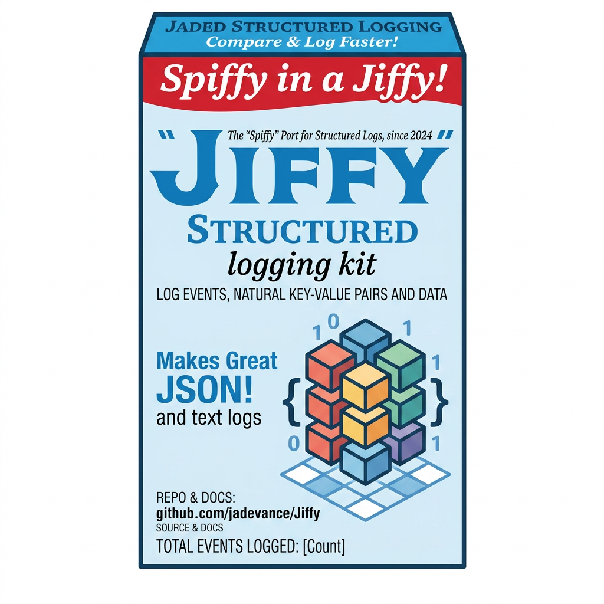

<p align="center">
  
</p>

# Jiffy

[](https://github.com/jadevance/Jiffy/actions/workflows/build.yml)

A Java port of [Spiffy.Monitoring](https://github.com/chris-peterson/Spiffy) — structured logging for the JVM with field names, output format, and idioms that match Spiffy line-for-line.

The goal is cross-stack fluency: a team running .NET services on Spiffy and JVM services on Jiffy can share Splunk dashboards, query patterns, and mental models with no translation step.

## Install

Published to [Maven Central](https://central.sonatype.com/artifact/io.github.jadevance/jiffy-core) as `io.github.jadevance:jiffy-core`.

Gradle:
```kotlin
dependencies {
    implementation("io.github.jadevance:jiffy-core:0.1.2")
}
```

Maven:
```xml
<dependency>
    <groupId>io.github.jadevance</groupId>
    <artifactId>jiffy-core</artifactId>
    <version>0.1.2</version>
</dependency>
```

sbt:
```scala
libraryDependencies += "io.github.jadevance" % "jiffy-core" % "0.1.2"
```

## Usage

```java
try (var ctx = new EventContext("UserService", "CreateUser")) {
    ctx.set("UserId", userId);
    try (var t = ctx.time("DbInsert")) {
        userRepository.insert(user);
    }
}
```

Emits one structured event on close (default `SpiffyNamingConvention`, matching Spiffy 7.x short field names):

```
[2026-05-15 14:23:01.234Z] Application=my-app l=Info c=UserService o=CreateUser ms=42.7 UserId=abc123 ms_DbInsert=38.1
```

## Configuration

```java
GlobalEventContext.instance().set("Application", "my-app");

Configuration.initialize(c -> c
    .providers().slf4j()        // default; routes via SLF4J at Level-appropriate severity
);
```

## Modules

- `jiffy-core` — `EventContext`, `GlobalEventContext`, `Configuration`, SLF4J + Console sinks
- (future) `jiffy-splunk` — direct HEC sink
- (future) `jiffy-micrometer` — counters/timers bridge

## Parity status

| Spiffy member          | Jiffy | Notes |
|------------------------|:-----:|-------|
| `EventContext(component, operation)` | done  | |
| `Set(key, value)`      | done  | `set(...)` |
| `Time(key)`            | done  | returns `AutoCloseable`; emits `<timeElapsed()>_<key>` (e.g. `ms_DbInsert` under default short convention) |
| `IncludeException`     | done  | escalates Level to Error, sets the reason to `"An exception has occurred"` (typo fixed from Spiffy original); emitted as `msg=` under short / `ErrorReason=` under legacy |
| `SetToInfo/Warning/Error` | done | |
| `Suppress / SuppressFields` | done | |
| `Count(key)`           | done  | emits `Count_<key>` |
| `AppendToValue`        | done  | |
| `Configuration.Initialize` | done | `Configuration.initialize(...)` |
| `GlobalEventContext.Instance` | done | `GlobalEventContext.instance()` |
| `TimerCollection Timers` property | done | `timers()` returns an unmodifiable `Map<String, TimedScope>`; each scope exposes `elapsedMilliseconds()` and `isRunning()` |
| `PrivateData`          | done  | `setPrivate / getPrivate / containsPrivate / privateData()`; never emitted |
| `CustomTimestamp`      | done  | `setCustomTimestamp(Instant)`; overrides the event timestamp at emit time |
| `IFieldNameLookup`     | done  | Pluggable [`NamingConvention`](#naming-conventions): `SPIFFY` (default, matches Spiffy 7.x `ShortFieldNameLookup`), `LEGACY` (matches Spiffy 6.x `LegacyFieldNameLookup`), `JAVA` (camelCase) |

## Advanced usage

**Private data** — stash values you want available during the event but kept out of the emitted log:

```java
try (var ctx = new EventContext("UserService", "CreateUser")) {
    ctx.setPrivate("RawToken", token);   // not emitted
    ctx.set("UserId", userId);           // emitted
}
```

**Custom timestamp** — useful when backfilling events from an upstream stream:

```java
try (var ctx = new EventContext("Replay", "Ingest")) {
    ctx.setCustomTimestamp(record.originalTimestamp());
}
```

**Timers collection** — introspect timers mid-event (e.g., to make routing decisions while a sub-operation is in flight):

```java
try (var ctx = new EventContext("Pipeline", "Run")) {
    var t = ctx.time("Stage1");
    // ... work ...
    if (ctx.timers().get("Stage1").elapsedMilliseconds() > 500) {
        ctx.set("SlowPath", true);
    }
    t.close();
}
```

## Naming conventions

Jiffy ships three naming conventions for **library-emitted standard fields**:

| Convention | Level | Component | Operation | TimeElapsed | Reason | Per-timer | Count |
|---|---|---|---|---|---|---|---|
| `SPIFFY` *(default — matches Spiffy 7.x `ShortFieldNameLookup`)* | `l` | `c` | `o` | `ms` | `msg` *(error & warning collapse)* | `ms_<key>` | `Count_<key>` |
| `LEGACY` *(matches Spiffy 6.x `LegacyFieldNameLookup`)* | `Level` | `Component` | `Operation` | `TimeElapsed` | `ErrorReason` / `WarningReason` | `TimeElapsed_<key>` | `Count_<key>` |
| `JAVA` *(idiomatic camelCase for OSS Java users)* | `level` | `component` | `operation` | `timeElapsed` | `message` *(collapse)* | `timeElapsed_<key>` | `count_<key>` |

Exception fields under `SPIFFY` and `LEGACY` are hardcoded as in Spiffy itself: `Exception_Type`, `Exception_Message`, `Exception_StackTrace`, `InnermostException_*`. Under `JAVA` they are `exceptionType`, `exceptionMessage`, `exceptionStackTrace`, `innermostException*`.

Select at configuration time:

```java
Configuration.initialize(c -> c
    .naming(NamingConvention.LEGACY)   // or .SPIFFY (default) / .JAVA
    .providers().slf4j()
);
```

**Scope**: only library-emitted standard fields go through the convention. User-provided keys passed to `set(...)` are emitted verbatim — your `ctx.set("UserId", 42)` always emits `UserId=42` regardless of the active convention. This keeps the convention boundary explicit and lets you adopt your own house style for domain fields.

**msg-field collapse**: under `SPIFFY` and `JAVA`, error and warning reasons share one field (`msg` / `message`) — matching Spiffy's design. Switching the level via `setToInfo()` / `setToWarning()` / `setToError()` automatically clears any prior reason so the emitted `msg` always agrees with `l`.

Custom conventions: implement `NamingConvention` directly if you need snake_case, SCREAMING_SNAKE, or anything else.

## License

MIT, matching Spiffy.
